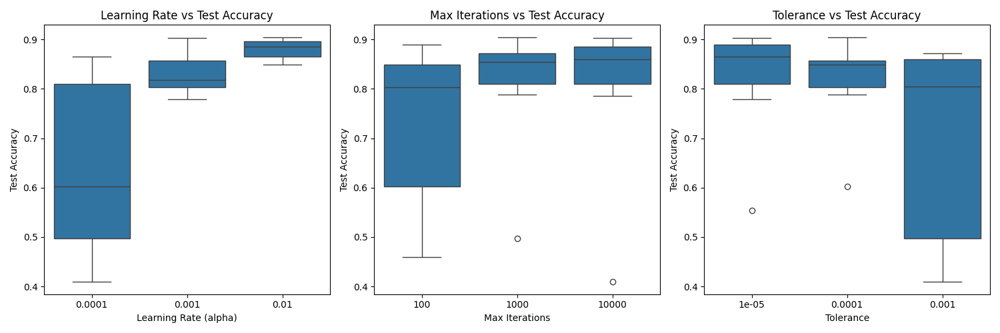

# Face Gender Classifier

A comprehensive **machine learning project** that implements **gender classification from facial images** using two distinct approaches: a **Neural Network Perceptron** and a **Support Vector Machine (SVM)**. The project was developed and evaluated on a carefully curated and balanced dataset comprising **2,307 facial images** (1,173 men and 1,134 women), with an **80-20 split for training and testing**.

Both models demonstrate robust performance, with the Perceptron achieving 94.96% accuracy on training and **90.48%** on testing, while the SVM reached 95.18% on training and **89.83%** on testing. This high performance is achieved through an extensive feature extraction pipeline that combines:
- Basic color analysis (RGB channels, statistical measures, and histograms)
- Advanced texture analysis (Gray Level Co-occurrence Matrix properties)
- Shape and gradient information (Histogram of Oriented Gradients)
- Geometric and statistical features (entropy, moments, and spatial relationships)

The project includes a user-friendly **GUI application** built with CustomTkinter that enables real-world testing and model comparison. Users can:
- Load images from local storage or web sources
- Select face regions using an intuitive rectangle selection tool
- Process images through both models simultaneously
- Compare prediction results and model confidence

<div align="center">
  
</div>

This tool bridges the gap between controlled environment testing and real-world application, providing insights into both models' generalization capabilities and practical effectiveness in gender classification tasks.
## Table of Contents
- [Overview](#overview)
- [Project Structure](#project-structure)
- [Installation](#installation)
- [Usage](#usage)
- [GUI Application](#gui-application)
- [Models](#models)
  - [Perceptron Results](#perceptron-results)
  - [SVM Results](#svm-results)
- [Dataset](#dataset)
- [Real-World Testing](#real-world-testing)
- [License](#license)

## Overview

This project implements and compares two different machine learning approaches for gender classification from facial images. The main objectives are:

### 1. Model Implementation and Comparison

#### Perceptron Neural Network
Grid Search Parameters:
- Learning Rate (alpha): [0.0001, 0.001, 0.01]
- Max Iterations: [100, 1000, 10000]
- Stopping Tolerance: [1e-3, 1e-4, 1e-5]

Top 5 models

<table>
    <thead>
        <tr>
            <th>Learning Rate</th>
            <th>Max Iterations</th>
            <th>Tolerance</th>
            <th>Train Accuracy</th>
            <th>Train Precision</th>
            <th>Train Recall</th>
            <th>Train F1</th>
            <th>Test Accuracy</th>
            <th>Test Precision</th>
            <th>Test Recall</th>
            <th>Test F1</th>
            <th>Accuracy Diff</th>
        </tr>
    </thead>
    <tbody>
        <tr>
            <td>0.01</td>
            <td>1000</td>
            <td>1e-4</td>
            <td>94.96%</td>
            <td>95.63%</td>
            <td>94.05%</td>
            <td>94.83%</td>
            <td>90.48%</td>
            <td>91.78%</td>
            <td>88.55%</td>
            <td>90.13%</td>
            <td>4.48%</td>
        </tr>
        <tr>
            <td>0.001</td>
            <td>10000</td>
            <td>1e-5</td>
            <td>94.80%</td>
            <td>95.72%</td>
            <td>93.61%</td>
            <td>94.65%</td>
            <td>90.26%</td>
            <td>92.52%</td>
            <td>87.22%</td>
            <td>89.80%</td>
            <td>4.54%</td>
        </tr>
        <tr>
            <td>0.01</td>
            <td>10000</td>
            <td>1e-4</td>
            <td>94.69%</td>
            <td>95.50%</td>
            <td>93.61%</td>
            <td>94.54%</td>
            <td>89.83%</td>
            <td>91.67%</td>
            <td>87.22%</td>
            <td>89.39%</td>
            <td>4.86%</td>
        </tr>
        <tr>
            <td>0.01</td>
            <td>1000</td>
            <td>1e-5</td>
            <td>95.93%</td>
            <td>96.64%</td>
            <td>95.04%</td>
            <td>95.83%</td>
            <td>89.61%</td>
            <td>91.63%</td>
            <td>86.78%</td>
            <td>89.14%</td>
            <td>6.32%</td>
        </tr>
        <tr>
            <td>0.01</td>
            <td>100</td>
            <td>1e-5</td>
            <td>90.84%</td>
            <td>91.84%</td>
            <td>89.31%</td>
            <td>90.55%</td>
            <td>88.96%</td>
            <td>92.31%</td>
            <td>84.58%</td>
            <td>88.28%</td>
            <td>1.88%</td>
        </tr>
    </tbody>
</table>

#### Support Vector Machine
Grid Search Parameters:
- C (Regularization): [0.0001, 0.001, 0.01, 0.1]
- Kernel: ['linear', 'rbf']
- Gamma: ['scale', 'auto', 0.1, 1]

Top 5 models

<table>
    <thead>
        <tr>
            <th>C</th>
            <th>Kernel</th>
            <th>Gamma</th>
            <th>Train Accuracy</th>
            <th>Train Precision</th>
            <th>Train Recall</th>
            <th>Train F1</th>
            <th>Test Accuracy</th>
            <th>Test Precision</th>
            <th>Test Recall</th>
            <th>Test F1</th>
            <th>Accuracy Diff</th>
            <th>Support Vectors</th>
        </tr>
    </thead>
    <tbody>
        <tr>
            <td>0.001</td>
            <td>linear</td>
            <td>scale</td>
            <td>95.18%</td>
            <td>96.06%</td>
            <td>94.05%</td>
            <td>95.04%</td>
            <td>89.83%</td>
            <td>91.67%</td>
            <td>87.22%</td>
            <td>89.39%</td>
            <td>5.35%</td>
            <td>665</td>
        </tr>
        <tr>
            <td>0.001</td>
            <td>linear</td>
            <td>auto</td>
            <td>95.18%</td>
            <td>96.06%</td>
            <td>94.05%</td>
            <td>95.04%</td>
            <td>89.83%</td>
            <td>91.67%</td>
            <td>87.22%</td>
            <td>89.39%</td>
            <td>5.35%</td>
            <td>665</td>
        </tr>
        <tr>
            <td>0.001</td>
            <td>linear</td>
            <td>0.1</td>
            <td>95.18%</td>
            <td>96.06%</td>
            <td>94.05%</td>
            <td>95.04%</td>
            <td>89.83%</td>
            <td>91.67%</td>
            <td>87.22%</td>
            <td>89.39%</td>
            <td>5.35%</td>
            <td>665</td>
        </tr>
        <tr>
            <td>0.001</td>
            <td>linear</td>
            <td>1</td>
            <td>95.18%</td>
            <td>96.06%</td>
            <td>94.05%</td>
            <td>95.04%</td>
            <td>89.83%</td>
            <td>91.67%</td>
            <td>87.22%</td>
            <td>89.39%</td>
            <td>5.35%</td>
            <td>665</td>
        </tr>
        <tr>
            <td>0.01</td>
            <td>linear</td>
            <td>scale</td>
            <td>99.08%</td>
            <td>99.33%</td>
            <td>98.79%</td>
            <td>99.06%</td>
            <td>88.31%</td>
            <td>89.14%</td>
            <td>86.78%</td>
            <td>87.95%</td>
            <td>10.77%</td>
            <td>518</td>
        </tr>
    </tbody>
</table>

### 2. Feature Engineering

All images are preprocessed by resizing to 128x128 pixels before feature extraction. The feature vector combines both basic color properties and advanced image analysis techniques:

<table>
    <thead>
        <tr>
            <th>Feature Category</th>
            <th>Feature Name</th>
            <th>Description</th>
            <th>Dimensionality</th>
        </tr>
    </thead>
    <tbody>
        <tr>
            <td rowspan="6"><strong>Basic Color Features</strong></td>
            <td>RGB Channels</td>
            <td>Separation of image into Red, Green, and Blue channels</td>
            <td>3 channels × (128×128)</td>
        </tr>
        <tr>
            <td>RGB Mean</td>
            <td>Average intensity value for each color channel</td>
            <td>3 values</td>
        </tr>
        <tr>
            <td>RGB Mode</td>
            <td>Most frequent intensity value in each channel</td>
            <td>3 values</td>
        </tr>
        <tr>
            <td>RGB Variance</td>
            <td>Spread of intensity values in each channel</td>
            <td>3 values</td>
        </tr>
        <tr>
            <td>RGB Standard Deviation</td>
            <td>Square root of variance for each channel</td>
            <td>3 values</td>
        </tr>
        <tr>
            <td>Color Histogram</td>
            <td>Distribution of pixel intensities (256 bins per channel)</td>
            <td>256 × 3 values</td>
        </tr>
        <tr>
            <td rowspan="5"><strong>Texture Analysis</strong></td>
            <td>GLCM Contrast</td>
            <td>Measures intensity contrast between pixel pairs</td>
            <td>1 value</td>
        </tr>
        <tr>
            <td>GLCM Dissimilarity</td>
            <td>Measures how different each pixel pair is</td>
            <td>1 value</td>
        </tr>
        <tr>
            <td>GLCM Homogeneity</td>
            <td>Measures closeness of element distribution</td>
            <td>1 value</td>
        </tr>
        <tr>
            <td>GLCM Energy</td>
            <td>Measures textural uniformity</td>
            <td>1 value</td>
        </tr>
        <tr>
            <td>GLCM Correlation</td>
            <td>Measures linear dependency of gray levels</td>
            <td>1 value</td>
        </tr>
        <tr>
            <td rowspan="4"><strong>Shape Features</strong></td>
            <td>HOG (Histogram of Oriented Gradients)</td>
            <td>Captures edge directions and gradients</td>
            <td>64 values</td>
        </tr>
        <tr>
            <td>Peak Local Max</td>
            <td>Identifies local maximum intensity points</td>
            <td>10 × 2 values</td>
        </tr>
        <tr>
            <td>Hu Moments</td>
            <td>Shape descriptors invariant to translation, rotation, and scale</td>
            <td>7 values</td>
        </tr>
        <tr>
            <td>Edge Density</td>
            <td>Ratio of edge pixels to total pixels</td>
            <td>1 value</td>
        </tr>
        <tr>
            <td rowspan="4"><strong>Statistical Features</strong></td>
            <td>Image Entropy</td>
            <td>Measures randomness in pixel intensity distribution</td>
            <td>1 value</td>
        </tr>
        <tr>
            <td>Laplacian Mean</td>
            <td>Average of second-order derivatives</td>
            <td>1 value</td>
        </tr>
        <tr>
            <td>Laplacian Standard Deviation</td>
            <td>Spread of second-order derivatives</td>
            <td>1 value</td>
        </tr>
        <tr>
            <td>Aspect Ratio</td>
            <td>Width to height ratio of the image</td>
            <td>1 value</td>
        </tr>
        <tr>
            <td><strong>Geometric Features</strong></td>
            <td>Circularity</td>
            <td>Measure of how circular the face region is</td>
            <td>1 value</td>
        </tr>
    </tbody>
</table>

#### Feature Processing Pipeline

1. **Image Preprocessing**
   - Resize to 128×128 pixels
   - Convert to appropriate color spaces (RGB/Grayscale)
   - Apply necessary filters and transformations

2. **Feature Extraction**
   - Extract all features independently
   - Normalize histograms and distributions
   - Calculate statistical measures

3. **Feature Vector Generation**
   - Concatenate all features into a single vector
   - Standardize features using StandardScaler
   - Final vector dimensionality: ~1000 features

4. **Feature Importance**
   - Color features capture skin tone and lighting variations
   - Texture features identify facial patterns
   - Shape features capture facial structure
   - Statistical features provide overall image characteristics

This comprehensive feature set enables the models to capture various aspects of facial characteristics that may be indicative of gender, leading to robust classification performance.

### 3. Real-World Application

The GUI application provides an intuitive interface for testing both models on real-world images. Below are some examples of the application in action:

<div align="center">
  <div style="display: grid; grid-template-columns: 1fr 1fr; gap: 10px;">
    
    
    
    
  </div>
</div>

Key Features:
- Real-time feature extraction and classification
- Support for both local and web images
- Manual face selection for precise testing
- Side-by-side model comparison

### 4. Performance Analysis

Comprehensive evaluation of both models' performance through various metrics and visualizations:

<div align="center">
  <div style="display: grid; grid-template-columns: 1fr 1fr; gap: 10px;">
    <div>
      <h4>Perceptron Analysis</h4>
      
      
    </div>
    <div>
      <h4>SVM Analysis</h4>
      
      
    </div>
  </div>
</div>

#### Key Findings

##### Perceptron Performance
- Best Configuration:
  - Learning Rate: 0.01
  - Max Iterations: 1000
  - Tolerance: 1e-4
- Results:
  - Training Accuracy: 94.96%
  - Testing Accuracy: 90.48%
  - Minimal overfitting (4.48% difference)
- Strengths:
  - Consistent performance across different hyperparameters
  - Good generalization capabilities
  - Fast inference time

##### SVM Performance
- Best Configuration:
  - C: 0.001
  - Kernel: linear
  - Gamma: scale
- Results:
  - Training Accuracy: 95.18%
  - Testing Accuracy: 89.83%
  - Moderate overfitting (5.35% difference)
- Strengths:
  - More stable predictions
  - Better handling of outliers
  - Fewer support vectors needed (665)

#### Comparative Analysis

1. **Accuracy Comparison**
   - Perceptron slightly outperforms SVM in test accuracy
   - Both models show similar training performance
   - Perceptron shows better generalization

2. **Training Efficiency**
   - SVM training is faster
   - Perceptron requires more iterations but achieves better final results
   - Both models show good convergence properties

3. **Model Complexity**
   - SVM: 665 support vectors in best model
   - Perceptron: Single layer with direct mapping
   - Trade-off between model complexity and performance

4. **Real-world Performance**
   - Both models show robust performance on unseen data
   - Similar confusion patterns in misclassifications
   - Complementary strengths in different scenarios

The analysis shows that while both models achieve comparable performance, the Perceptron demonstrates slightly better generalization capabilities, making it the preferred choice for this specific gender classification task.

## Project Structure

<pre>
Face-Gender-Classifier/
├── Data/                          
│   ├── Man/
│   │   ├── face_0.jpg
│   │   ├── face_1.jpg
│   │   ├── face_2.jpg
│   │   └── ...
│   │
│   ├── Woman/
│   │   ├── face_0.jpg
│   │   ├── face_1.jpg
│   │   ├── face_2.jpg
│   │   └── ...
│   │
│   ├── Data.csv                    # All data in a CSV (image paths only) and other specifications 
│   ├── test_dataset.csv            # Test set (20%)
│   ├── train_dataset.csv           # Train set (80%)
│
├── Models/                         # Saved trained models
│   ├── best_perceptron_model.pth   # Trained Perceptron model
│   ├── perceptron_scaler.pkl       # Scaler for Perceptron features
│   ├── best_svm_model.pkl          # Trained SVM model
│   └── svm_scaler.pkl              # Scaler for SVM features
│
├── Results/                         # Training results and visualizations
│   ├── Perceptron/
│   │   ├── confusion_matrix_perceptron.png
│   │   ├── hyperparameters_metrics_perceptron.png
│   │   ├── loss_accuracy_perceptron.png
│   │   └── perceptron_results.txt
│   │
│   ├── SVM/
│   │   ├── confusion_matrix_svm.png
│   │   ├── hyperparameters_metrics_svm.png
│   │   ├── correlation_analysis_svm.png
│   │   └── svm_results.txt
│   │
│   └── App/
│       ├── app.png
│       ├── perceptronResult1.png
│       ├── svmResult1.png
│       ├── perceptronResult2.png
│       └── svmResult2.png
│
├── Scripts/                         # Source code
│   ├── customTools.py              # Feature extraction and model classes
│       ├── class Image            # Feature extraction implementation
│       └── class Perceptron      # Neural network implementation
│
├── app.py                          # GUI application
├── Perceptron.ipynb                # Detailed notebook for perceptron
├── SVM.ipynb                       # Detailed notebook for svm
├── requirements.txt                # Project dependencies
└── README.md
</pre>

### Key Components

1. **Models Directory**
   - Contains trained models and their corresponding scalers
   - Models are saved in their native formats (PyTorch for Perceptron, pickle for SVM)
   - Scalers ensure consistent feature scaling during inference

2. **Results Directory**
   - Organized by model type
   - Contains visualizations of model performance
   - Includes detailed metric reports
   - Stores hyperparameter analysis results
   - Contains real-world results from both models

3. **Scripts Directory**
   - Contains core implementation files
   - Includes all the functions and implementations used in the notebooks and the app

4. **Application**
   - Main GUI application for real-world testing
   - Implements both models in a user-friendly interface
   - Provides real-time feature extraction and classification

## Installation

### Prerequisites
- Python 3.10.15 (Reccomended for cuda)
- CUDA-capable GPU (Perceptron was built for cuda using Pytorch, SVM can use CPU)
- Git

### Environment Setup

1. Clone the repository:
```bash
git clone https://github.com/yourusername/face-gender-classifier.git
cd face-gender-classifier
```
2. Install dependencies:
```bash
pip install -r requirements.txt
```
**GPU Support**
1. Check your CUDA version:
```bash
nvidia-smi
```
2. Install appropriate PyTorch version:
```bash
pip3 install torch torchvision torchaudio --index-url https://download.pytorch.org/whl/cu118
#Or
pip install torch torchvision torchaudio --index-url https://download.pytorch.org/whl/cu118
```

## USAGE
## GUI Application

1. **Start the application:**
```bash
python app.py
```
2. **Using the interface**:
   - Click "Load Image" to select an image
   - Draw a rectangle around the face using the mouse
   - Use "Predict (SVM)" or "Predict (Perceptron)" buttons to classify
   - View results in the prediction panel
   - Compare results between models

<div align="center">
  <div style="display: grid; grid-template-columns: repeat(3, 1fr); gap: 10px;">
    <!-- First row -->
    
    
    
    <!-- Second row-->
    
    
    
  </div>
</div>

## Models

### Perceptron Results

The Neural Network Perceptron achieved excellent results in gender classification, demonstrating strong generalization capabilities:

<div align="center">
  <div style="display: grid; grid-template-columns: 1fr 1fr; gap: 10px;">
    
    
    
    
  </div>
</div>

Best Model Performance:
- Training Accuracy: 94.96%
- Testing Accuracy: 90.48%
- Training/Testing Difference: 4.48%

Key Characteristics:
- Learning Rate: 0.01
- Max Iterations: 1000
- Tolerance: 1e-4
- Convergence achieved before maximum iterations
- Minimal overfitting despite high model capacity

### SVM Results

The Support Vector Machine showed robust performance with excellent stability:

<div align="center">
  <div style="display: grid; grid-template-columns: 1fr 1fr; gap: 10px;">
    
    
    
    
  </div>
</div>

Best Model Performance:
- Training Accuracy: 95.18%
- Testing Accuracy: 89.83%
- Training/Testing Difference: 5.35%

Key Characteristics:
- Linear kernel
- C: 0.001
- Gamma: scale
- Support Vectors: 665
- Good balance between model complexity and performance

### Model Comparison

Both models demonstrated strong performance, with some key differences:

1. **Accuracy**
   - Perceptron slightly better in test accuracy (90.48% vs 89.83%)
   - SVM slightly better in training accuracy (95.18% vs 94.96%)

2. **Generalization**
   - Perceptron: 4.48% accuracy difference
   - SVM: 5.35% accuracy difference
   - Both show good generalization capabilities

3. **Practical Considerations**
   - Perceptron requires GPU for optimal performance
   - SVM works efficiently on CPU
   - Both suitable for real-time applications

## Dataset

The dataset used in this project was obtained from the [Gender Classification Dataset](https://www.kaggle.com/datasets/sodiqismoilov/gender) on Kaggle. It consists of facial images carefully selected to maintain balance between classes.

### Dataset Distribution

<table>
    <tr>
        <th>Class</th>
        <th>Training Set</th>
        <th>Testing Set</th>
        <th>Total Images</th>
        <th>Percentage</th>
    </tr>
    <tr>
        <td>Man</td>
        <td>938</td>
        <td>235</td>
        <td>1,173</td>
        <td>50.8%</td>
    </tr>
    <tr>
        <td>Woman</td>
        <td>907</td>
        <td>227</td>
        <td>1,134</td>
        <td>49.2%</td>
    </tr>
    <tr>
        <td><strong>Total</strong></td>
        <td><strong>1,845</strong></td>
        <td><strong>462</strong></td>
        <td><strong>2,307</strong></td>
        <td><strong>100%</strong></td>
    </tr>
</table>

### Dataset Characteristics

- **Image Format**: JPG
- **Original Dimensions**: Variable sizes
- **Preprocessed Dimensions**: 128x128 pixels
- **Color Space**: RGB
- **Class Balance**: Nearly perfect (50.8% men, 49.2% women)
- **Train/Test Split**: 80/20 ratio maintaining class distribution

### Sample Images

<div align="center">
  <table>
    <tr>
      <td align="center">
        
        <br>
        Man Sample 1
      </td>
      <td align="center">
        
        <br>
        Woman Sample 1
      </td>
      <td align="center">
        
        <br>
        Man Sample 2
      </td>
      <td align="center">
        
        <br>
        Woman Sample 2
      </td>
    </tr>
  </table>
</div>

## Real-World Testing

To evaluate the models' performance in real-world scenarios, we tested both the Perceptron and SVM on various facial images outside the training dataset. Below are examples of the classification results:

### Perceptron Results

<div align="center">
  <div style="display: grid; grid-template-columns: repeat(5, 1fr); gap: 5px;">
    
    
    
    
    
    
    
    
    
    
    
    
    
    
    
    
    
    
    
    
    
    
    
    
    
  </div>
</div>

### SVM Results

<div align="center">
  <div style="display: grid; grid-template-columns: repeat(5, 1fr); gap: 5px;">
    
    
    
    
    
    
    
    
    
    
    
    
    
    
    
    
    
    
    
    
    
    
    
    
    
  </div>
</div>

## License

This project is licensed under the MIT License.

```
MIT License

Copyright (c) 2024 [Your Name]

Permission is hereby granted, free of charge, to any person obtaining a copy
of this software and associated documentation files (the "Software"), to deal
in the Software without restriction, including without limitation the rights
to use, copy, modify, merge, publish, distribute, sublicense, and/or sell
copies of the Software.
```

The dataset used in this project is from Kaggle and is subject to its own licensing terms. Please refer to the [original dataset](https://www.kaggle.com/datasets/sodiqismoilov/gender) for more information.
